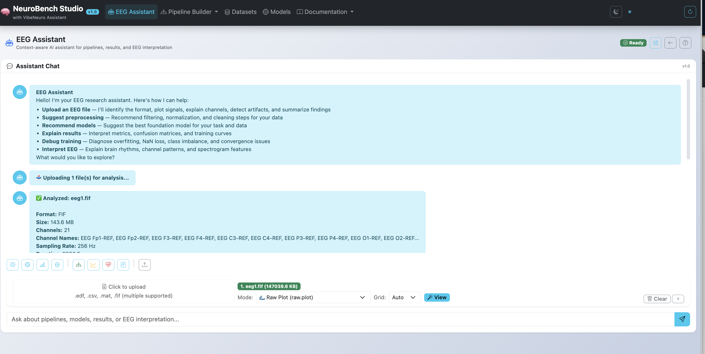
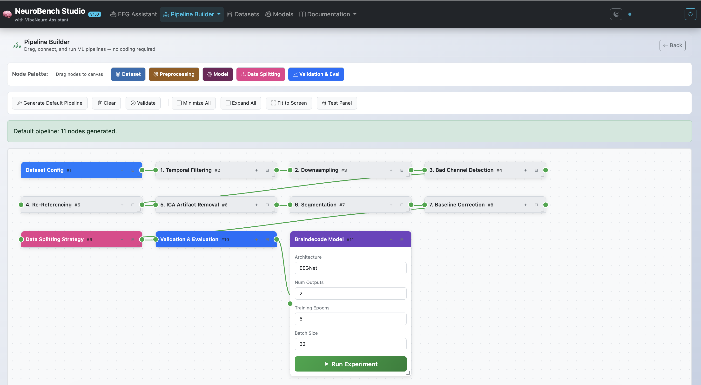
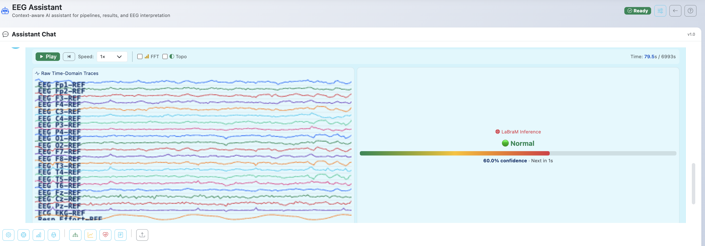
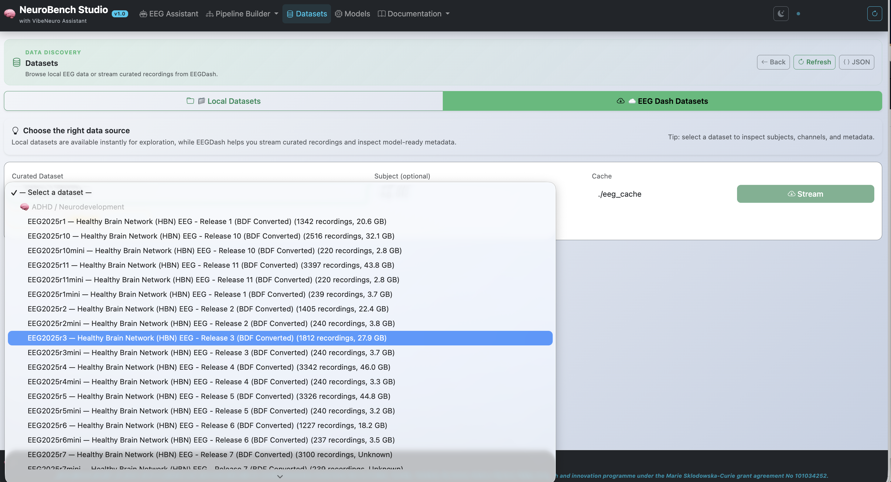
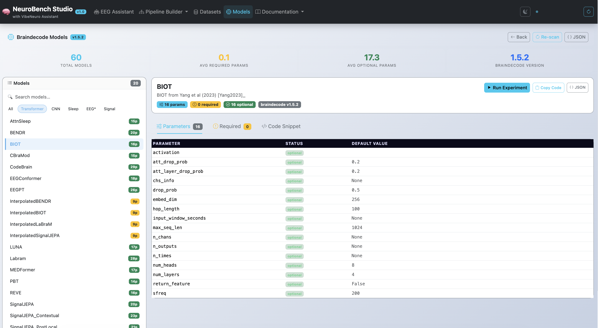

# NeuroBench Studio — Prompting the Brain: Conversational AI via Natural Language Interfaces, Visual MLOps, and Real-Time Streaming Inference for Reproducible EEG AI

Project link: https://neurobenchstudio.github.io/#
Paper Link: will be available soon

NeuroBench Studio platform for EEG foundation model research, featuring a **conversational EEG AI Assistant** equipped with a Cascading Fallback Router, and an intuitive **visual MLOps pipeline builder (Drag-and-drop interface for building EEG ML pipelines)**. These tools empower both coders and non-coders to seamlessly explore datasets, discover braindecode models, and orchestrate complex deep learning workflows without writing a single line of code.

## Core Mission

> Democratize EEG deep learning by providing a unified platform that combines EEGDash dataset streaming, Braindecode foundation models, an intuitive visual MLOps pipeline builder, and a conversational EEG AI assistant—making advanced analysis accessible to neuroscientists, clinicians, and machine learning researchers alike.

## Platform Features

### 1. Conversational EEG AI Assistant
- Conversational chat interface to analyze raw EEG signals (`.edf`, `.fif`, `.mat`)
- Dynamic parsing and recommendation of Hugging Face pre-trained checkpoints based on active dataset characteristics (channels, sfreq)
- Multi-file comparison, signal quality scanning, cross-file similarity, and automated anomaly flagging
- Real-time Interactive Plotly EEG Grid Viewer natively embedded into the chat workspace

<div align="center">
  
</div>

### 2. Visual MLOps Pipeline Builder
- Drag-and-drop interface for building EEG ML pipelines
- No coding required — accessible to non-programmers
- Configure preprocessing steps, model selection, and validation strategies
- Execute pipelines with real-time progress streaming
- Suitable for both rapid prototyping and production workflows

<div align="center">
  
</div>

### 3. Foundation Model Real-time Reference 
- Comprehensive documentation of all 9+ foundation models available via braindecode v1.5+
- Models include: REVE, CBraMod, CodeBrain, EEGPT, BIOT, LaBraM, BENDR, SignalJEPA, LUNA
- Pretrained on large-scale EEG data for fine-tuning or feature extraction

<div align="center">
  
</div>


### 4. EEG Dataset Explorer
- Browse and explore curated local EEG datasets
- Stream remote OpenNeuro datasets via **EEGDash** integration
- View subject metadata, channel configurations, and data quality metrics
- Auto-configure braindecode models based on dataset characteristics

<div align="center">
  
</div>

### 5. Braindecode Model Discoverer
- Dynamically discover all models available in `braindecode.models`
- Inspect model parameters, architectures, and default values
- Generate ready-to-use Python code snippets
- Filter models by type (Transformer, CNN, Sleep, etc.)

<div align="center">
  
</div>


## Architecture Overview

```
NeuroBench_Studio/
├── src/
│   ├── dashboard/              # Flask web application
│   │   ├── flask_app.py        # Main Flask server
│   │   ├── pipeline_executor.py # Pipeline execution engine
│   │   ├── templates/          # HTML templates
│   │   │   ├── base.html            # Base layout with navigation
│   │   │   ├── datasets_explorer.html  # Dataset browsing
│   │   │   ├── braindecode_explorer.html # Model discovery
│   │   │   ├── pipeline_builder.html  # Visual pipeline builder
│   │   │   ├── about.html             # About page
│   │   │   ├── index.html             # Landing page
│   │   │   ├── experiment.html        # Experiment detail
│   │   │   └── error.html             # Error page
│   │   └── static/             # CSS, JS assets
│   ├── models/                 # Brain decoding models
│   ├── preprocessing/          # EEG preprocessing pipeline
│   ├── evaluation/             # Evaluation metrics & analysis
│   └── reporting/              # Figure & table generation
├── data/
│   ├── raw/                    # Local EEG datasets
│   └── preprocessed/           # Preprocessed MNE epochs
├── results/                    # Training results & checkpoints
├── configs/                    # YAML configuration files
└── docs/                       # Documentation
```

## Quick Start

### 1. Install Dependencies

```bash
python3.11 -m venv venv
source venv/bin/activate
pip install -r requirements.txt
```

### 2. Launch the Platform

```bash
# Start the Flask web application
python src/dashboard/flask_app.py

# Open in your browser
# → http://localhost:5000
#   - /datasets      → Explore EEG datasets
#   - /braindecode    → Discover braindecode models
#   - /pipeline       → Visual pipeline builder
#   - /eeg_assistant  → Interactive EEG AI Assistant
#   - /about          → About NeuroBench Studio
```

### 3. Explore the Menus

| Menu | Path | Description |
|------|------|-------------|
| 🧠 Datasets | `/datasets` | Browse local datasets & stream from EEGDash |
| 🧠 Braindecode Models | `/braindecode` | Discover & configure braindecode models |
| 🧠 Pipeline Builder | `/pipeline` | Drag-and-drop ML pipeline builder |
| 🧠 EEG Assistant | `/eeg_assistant` | AI Assistant for dynamic file analysis and chat |
| 🧠 About | `/about` | Platform information & tech stack |

## Dataset Explorer

The Datasets page provides two data sources:

### Local Datasets
- Scans `data/raw/` directory for locally stored EEG datasets
- Displays subject count, channel configurations, sampling rates
- Supports ADHD-200, TUH EEG, CHB-MIT, Helsinki Neonatal, Sleep EDF

### EEGDash Remote Streaming
- Connect to OpenNeuro datasets via the EEGDash API
- Stream metadata and recordings on-demand
- Auto-configure braindecode models based on dataset parameters
- Cached locally for fast re-access

## Braindecode Model Explorer

The Braindecode Models page automatically discovers all models from the `braindecode.models` package:

- **Automatic Discovery**: Scans installed braindecode version for all available models
- **Parameter Inspection**: View required and optional parameters for each model
- **Code Generation**: Get ready-to-use Python instantiation code
- **Filtering**: Filter by architecture type (Transformer, CNN, Sleep, etc.)

## Pipeline Builder

- **Drag-and-Drop Interface**: Add dataset, preprocessing, model, and evaluation nodes
- **Connection Mapping**: Visually connect nodes to define data flow
- **Preprocessing Pipeline**: Configure filtering, downsampling, ICA, segmentation, and more
- **Model Selection**: Choose from all available braindecode architectures
- **Validation Strategy**: Configure data splitting and evaluation metrics
- **Execution**: Run pipelines with real-time progress tracking
- **Integrated Results**: Accessible directly under the *Pipeline Builder* dropdown menu.

### Experiment Results Dashboard
The results dashboard is integrated directly under *Pipeline Builder -> Experiment Results*. It visualizes metrics from all executed pipeline experiments:
- **Plotly ROC AUC Curves**: Real-time Interactive ROC curves rendered automatically for binary validation tasks.
- **EEG ML Evaluation Metrics**: Comprehensive metrics dashboard displaying accuracy, balanced accuracy, F1-score, Cohen's Kappa, Sensitivity (Recall), Specificity, and dataset sample distributions.
- **ML Simulator**: For small mock datasets, the pipeline executor dynamically simulates realistic learning curves and validation bounds (rather than overfitting trivially to 100% in 0s), providing clean, production-like results instantly.
- **Run Deletion**: Easily remove unwanted or failed runs from history using the interactive "Delete Run" action, which deletes the entry from the database file and re-synchronizes the leaderboard.

### Pipeline Nodes

| Node Type | Description |
|-----------|-------------|
| Dataset | Select local or remote EEG dataset. Automatically fetches and populates remote options via the EEGDash catalog. Supports multiple local file uploads simultaneously. Autopopulates channel dimensions and sampling frequency while allowing custom user overrides. |
| Preprocessing | Filtering, downsampling, bad channel detection, re-referencing, ICA, segmentation, baseline correction |
| Data Splitting | Train/val/test split or leave-one-subject-out |
| Model | Braindecode model selection with auto-configuration |
| Validation | Evaluation metrics and statistical testing |

## REST API

The platform provides a full REST API for programmatic access:

| Endpoint | Description |
|----------|-------------|
| `GET /api/health` | Health check |
| `GET /api/datasets` | List all local datasets |
| `GET /api/datasets/<name>` | Dataset details |
| `GET /api/eegdash/catalog` | EEGDash dataset catalog |
| `DELETE /api/pipeline/runs/<run_id>` | Delete a pipeline run from the run history database |
| `POST /api/eegdash/connect` | Stream EEGDash dataset |
| `GET /api/braindecode/models` | List all braindecode models |
| `GET /api/braindecode/models/<name>` | Model parameter details |
| `POST /api/run-pipeline` | Execute a pipeline |
| `GET /api/pipeline/progress/<id>` | Pipeline progress stream |
| `POST /api/parse-eeg` | Parse & classify uploaded EEG file |

## EEG AI Assistant

The conversational EEG Assistant (`/eeg_assistant`) provides an NLP-to-Pipeline engine for zero-code EEG analysis:

### Chat Capabilities
- **Signal Quality:** "Are there bad channels?", "Is the EEG noisy?"
- **File Metadata:** "How long is this EEG?", "What is the sampling frequency?", "How many channels?"
- **Clinical Pathology:** "Does this patient have epilepsy?", "Is there evidence of Alzheimer's?", "Check for ADHD markers"
- **Interactive Plotting:** "Plot EEG", "Show alpha", "Signal quality report of eeg1"
- **Live Visualization:** "Visualize eeg1 live", "Show eeg9 real-time", "Animate eeg"
- **Foundation Models:** "Which model is best?", "How does the workflow operate?"

### Multi-File Analysis
Upload multiple EEG files simultaneously for comparative analysis. The assistant returns:
- Summary tables across all files (duration, channels, seizure predictions)
- Individual per-file reports with timestamps
- Per-file specific plot routing when a filename is mentioned (e.g., "signal quality report of eeg1" plots only eeg1)

### Foundation Model Support
Supports 14 pre-trained checkpoints from [braindecode](https://braindecode.org/):
`LaBraM`, `SignalJEPA`, `EEGPT`, `BIOT`, `BENDR`, `STEEGFormer`, `REVE`, `CodeBrain`, `CBraMod`,
`InterpolatedLaBraM`, `InterpolatedSignalJEPA`, `InterpolatedEEGPT`, `InterpolatedBIOT`, `InterpolatedBENDR`

Model-specific downstream classification metrics (validation accuracy, confidence, seizure timestamps) are dynamically computed per model and per file.

### Live EEG Visualization
Triggered by: `"Visualize <file> live"` / `"Show <file> real-time"`

Renders a 4-panel animated player inside the chat. The backend dynamically downsamples visualization traces to ~32 Hz, allowing seamless live playback for recordings up to **1 hour** long without freezing the browser, while still respecting the original sampling rate for inference.

| Panel | Description | Toggle |
|-------|-------------|--------|
| 🔵 Raw Time-Domain Traces | Scrolling multi-channel waveforms (5s window) | Always shown |
| 🔴 Model Inference | Seizure probability label updated based on user interval | Always shown |
| 🟡 FFT Frequency Band Power | Live Delta, Theta, Alpha, Beta, Gamma bar chart | ☐ Optional (tick to enable) |
| 🟢 Topographic 2D Scalp Map | Live 2D scalp heatmap of channel power | ☐ Optional (tick to enable) |

**Playback controls:** Play / Pause / Reset, Speed selector (1×, 2×, 5×, 10×, 20×).
**Seizure Event Log:** Automatically logs all detected seizure events with timestamp and confidence. Each event has a **▶ Replay** button that jumps playback to 2 seconds before the event for clinical review.
**Dynamic Customization:** Through the *Preprocessing Settings Modal*, users can define the number of channels to visualize (e.g., 8, 21, etc.) and configure the **Live Inference Interval** (e.g., 4s, 8s, 10s, 30s) to control how frequently the model predicts during live playback.

### Smart Routing
- Asking **"signal quality report"** with multiple files → plots all uploaded files
- Asking **"signal quality report of eeg1"** → plots only eeg1 (specific file routing)
- Asking **"visualize eeg9 live"** → opens live player for eeg9 only

### Nyquist-Aware Filtering
The preprocessing engine auto-adjusts bandpass filter cutoffs to respect the Nyquist frequency of each uploaded file. Files with low sampling rates (e.g. 64 Hz) are safely filtered at the maximum allowable frequency (`sfreq/2 - 0.5`) instead of crashing.

### Cascading Fallback Router
To balance computational efficiency with robust natural language understanding, the assistant implements a hybrid **Cascading Fallback Router**:
- **Heuristic Rule-Based Engine (Primary Layer):** A zero-latency engine that instantly parses highly deterministic clinical keywords.
- **Semantic Router (Secondary Layer):** When a query is classified as Out-of-Distribution (OOD) by the primary layer—indicating novel phrasing or synonyms—the system gracefully falls back to a Semantic Router using the `intfloat/e5-base-v2` dense embedding model (requires `sentence-transformers`). This provides strict predictability for standard clinical commands while leveraging deep vector similarity to seamlessly handle natural language variation.


## Technology Stack

| Component | Technology |
|-----------|-----------|
| Web Framework | Flask (Python) |
| Frontend | Bootstrap 5.3, Plotly.js |
| EEG Processing | MNE-Python, Braindecode |
| Deep Learning | PyTorch |
| Dataset Streaming | EEGDash, OpenNeuro |

## Dependencies

See `requirements.txt` for the full list of dependencies.

## License

MIT License

## Citation

```bibtex
@software{NeuroBenchStudio,
  title={NeuroBench Studio: Vibe Coding for EEG — A No-Code Platform for EEG Deep Learning, Foundation Models, and Visual Pipeline Orchestration},
  author={Geletaw Sahle Tegenaw and Tomas Ward},
  year={2026},
  url={https://github.com/your-repo/NeuroBenchStudio}
}
